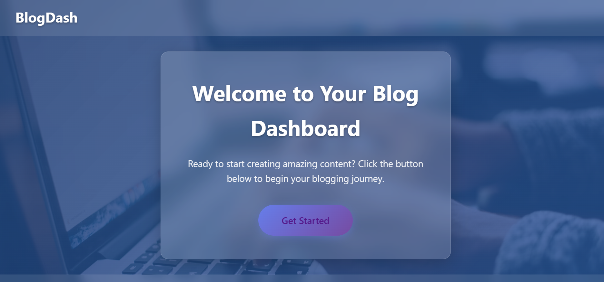
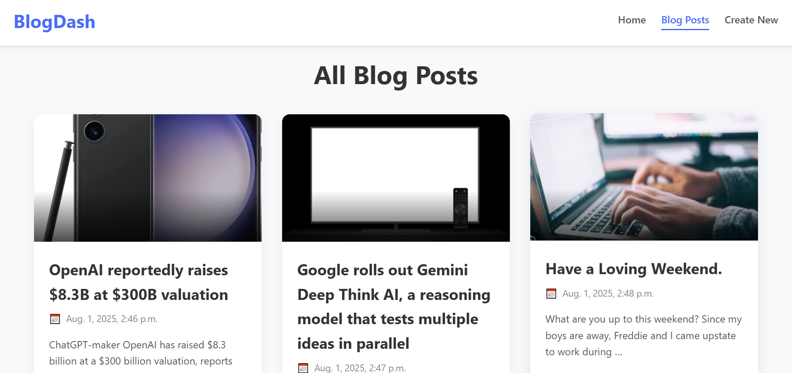
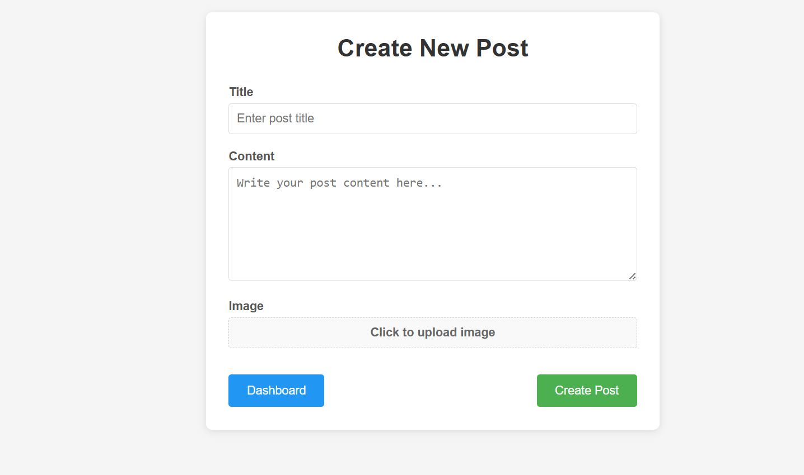
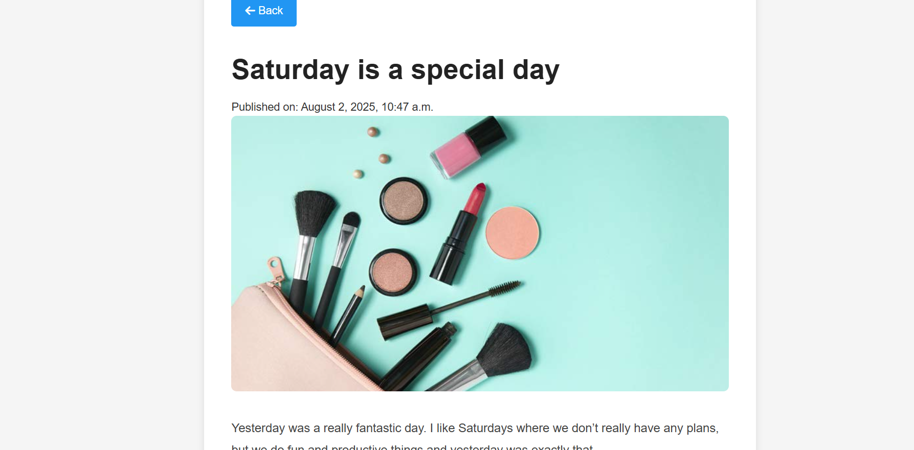

# 📝 Simple Django Blog Application

## 📌 Overview

This is a beginner-friendly Django blog application that allows users to **create** and **view** blog posts. Each post contains a title, content, image, and the date it was created. This project demonstrates the core features of the Django framework including models, forms, views, and templates.

---

## ✅ Features

- 📄 Create new blog posts via a user-friendly form
- 👁 View individual blog posts in detail
- 🖼 Upload images for each post
- 🕒 Automatically records post creation date
- 🧭 Clean and simple interface with basic styling

---

## 🛠 Tech Stack

- **Framework:** Django
- **Language:** Python
- **Frontend:** HTML, CSS, Font Awesome
- **Database:** SQLite
- **Media Handling:** Django built-in support

---

## 📸 Screenshots

### Home

---

### Dashboard

---

### 🖊️ Create Blog Post Page

---

### 👁️ View Blog Post Page

